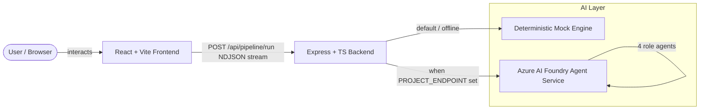
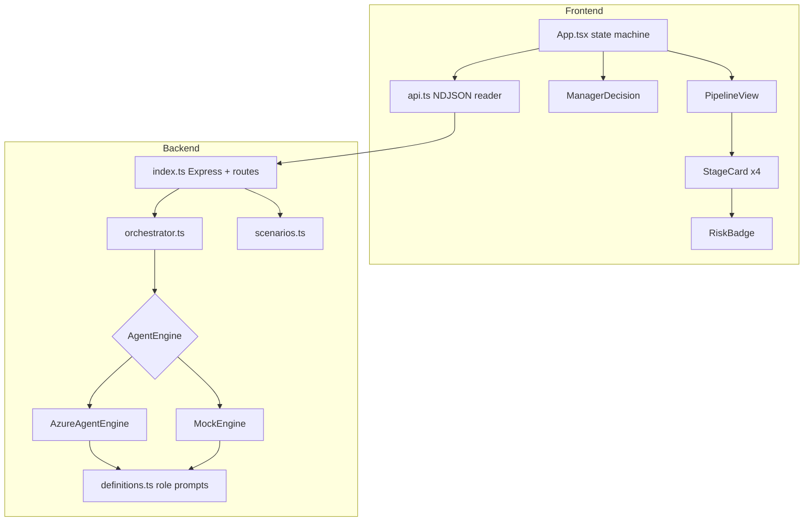
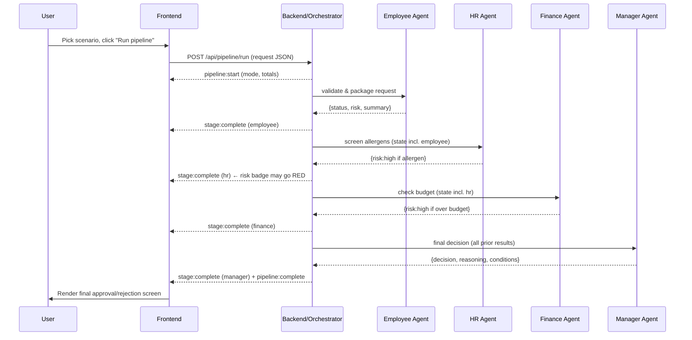
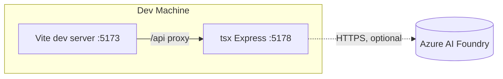

# High-Level Design (HLD)
## Multi-Agent "Zero-Trust" Decision Pipeline

**Version:** 1.0
**Date:** 2026-09-29
**Status:** Implemented (mock engine + Azure AI Foundry engine)

---

## 1. Purpose

The application demonstrates a **multi-agent AI decision workflow** using a
"zero-trust" approval model. A team lunch-order request is passed through a
sequence of specialist AI agents — **Employee → HR → Finance → Manager** — where
each agent has a single responsibility and no stage is trusted until the next
stage independently re-evaluates the request. The Manager agent makes the final
approve/reject decision with explicit reasoning.

It is a reference implementation for:

- **Multi-agent orchestration** — chaining independent agents with state passing.
- **Zero-trust design** — every stage re-validates; nothing auto-approves.
- **Human-in-the-loop framing** — a final decision screen with reasoning.
- **Streaming UX** — stage-by-stage progress rendered live.

---

## 2. Business Value / Usefulness

| Concern | How the app addresses it |
| --- | --- |
| **Governance** | Each policy (allergens, budget) is enforced by a dedicated agent, mirroring real separation-of-duties controls. |
| **Auditability** | Every stage emits a structured result (status, risk, reasoning, findings) — a complete decision trail. |
| **Explainability** | The Manager agent cites which upstream findings drove the decision, not just a yes/no. |
| **Extensibility** | New policy gates (e.g., Legal, Security) are added by inserting a new agent in the pipeline. |
| **Portfolio / demo** | Proves understanding of agent orchestration, state passing, and streaming — beyond a single chat completion. |

The lunch-order domain is a deliberately simple, relatable stand-in. The same
pipeline pattern applies to **expense approvals, procurement, access requests,
loan underwriting, content moderation**, or any multi-gate approval flow.

---

## 3. System Context



---

## 4. Logical Architecture



---

## 5. The Pipeline (Core Flow)



**Zero-trust rule:** the Manager **rejects** if HR reported `high` allergen risk
**or** Finance reported a hard budget overrun; otherwise approves (with
conditions if any stage was `medium`).

---

## 6. Technology Stack

| Layer | Technology |
| --- | --- |
| Frontend | React 18, TypeScript, Vite, plain CSS (dark theme) |
| Backend | Node.js, Express 4, TypeScript, `tsx`, Zod validation |
| AI (real) | Azure AI Foundry Agent Service via `@azure/ai-projects` + `@azure/identity` |
| AI (offline) | Deterministic `MockEngine` (same rules, no cloud) |
| Transport | HTTP + newline-delimited JSON (NDJSON) streaming |

---

## 7. Key Architectural Decisions

| # | Decision | Rationale |
| --- | --- | --- |
| 1 | Common `AgentEngine` interface with Azure + Mock implementations | Demo runs instantly offline; real Azure is a config switch, not a code change. |
| 2 | NDJSON streaming over WebSockets/SSE | Simple, works with a plain `fetch` + `POST`; no extra protocol/server. |
| 3 | One Azure agent per role | Enforces separation of duties; each agent has its own instructions. |
| 4 | Agents provisioned lazily & cached | Avoids recreating agents on every request; reusable via `*_AGENT_ID`. |
| 5 | Structured JSON output from each agent | Deterministic parsing, auditable findings, consistent UI rendering. |
| 6 | `DefaultAzureCredential` | No secrets in code; supports `az login`, managed identity, service principal. |

---

## 8. Azure AI Foundry — What You Must Create

To switch from the mock engine to real agents you need, **at minimum**:

1. **An Azure AI Foundry project** (create a hub + project at https://ai.azure.com).
2. **A deployed chat model** inside that project (e.g. `gpt-4o-mini`) — note the
   *deployment name*.
3. **The project endpoint** (looks like
   `https://<resource>.services.ai.azure.com/api/projects/<project>`).
4. **An RBAC role** on the project for your identity — `Azure AI User` /
   `Azure AI Developer` — then `az login` locally.

> The app **auto-creates** the four role agents on startup from the built-in
> instructions, so you do **not** need to hand-create agents. Optionally, if you
> pre-create agents in the Foundry portal, put their IDs in
> `EMPLOYEE_AGENT_ID`, `HR_AGENT_ID`, `FINANCE_AGENT_ID`, `MANAGER_AGENT_ID`
> and the app will reuse them instead.

Set these in `backend/.env`:

```
PROJECT_ENDPOINT=https://<resource>.services.ai.azure.com/api/projects/<project>
MODEL_DEPLOYMENT_NAME=gpt-4o-mini
```

Full step-by-step is in the LLD, section "Azure Foundry Provisioning".

---

## 9. Non-Functional Characteristics

| Attribute | Approach |
| --- | --- |
| **Security** | No secrets in code; `DefaultAzureCredential`; input validated with Zod; CORS enabled for local dev. |
| **Resilience** | Azure engine init failure falls back to mock; per-stage errors stream an `error` event and stop the pipeline cleanly. |
| **Performance** | Streaming gives immediate feedback; mock stages add small delays only for animation. |
| **Extensibility** | Add a stage = add a role to `definitions.ts` + `PIPELINE_ORDER`. |
| **Observability** | Structured per-stage results; engine mode logged on startup. |

---

## 10. Deployment View (Local)



- Frontend dev server: `http://localhost:5173` (proxies `/api` → `:5178`).
- Backend: `http://localhost:5178`.
- Azure is contacted only when `PROJECT_ENDPOINT` is configured.
